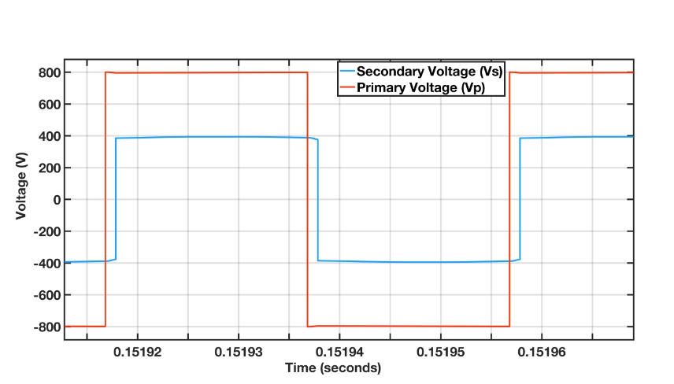
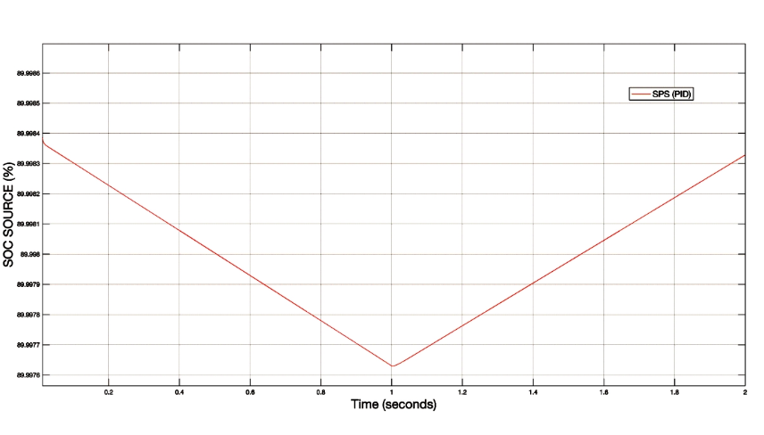

# Dual-Active-Bridge-Converter (DAB)

MATLAB/Simulink models for a Dual Active Bridge (DAB) DC-DC converter with solar PV integration. Includes standalone DAB configurations, variable load conditions, and test cases for analyzing converter performance in renewable energy applications and EV charging.

---

## Single Phase Shift Modulation Technique

The primary and secondary voltage phase difference determines the power flow between the primary and secondary side of the transformer. This modulation technique is implemented in the <code>DAB_Rload.slx</code> file. Also, 

## DAB DC - DC converter with Battery load

A Battery is connected at load that will charge for T=1sec and discharge after T=1sec. Inbuilt simulink generic model of Battery is used in this project, in order to show the %SOC of the EV Battery. This way, the bidirectional power flow from vehicle to Grid and Grid to vehicle can be easily analyzed. The charging and discharging of Load Battery is shown in the Figure. The DAB DC - DC converter with Battery load is given in <code>DAB_batteryload.slx</code> file.

