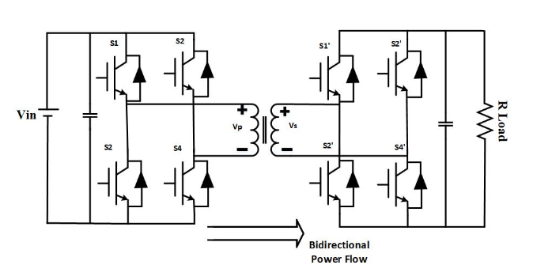
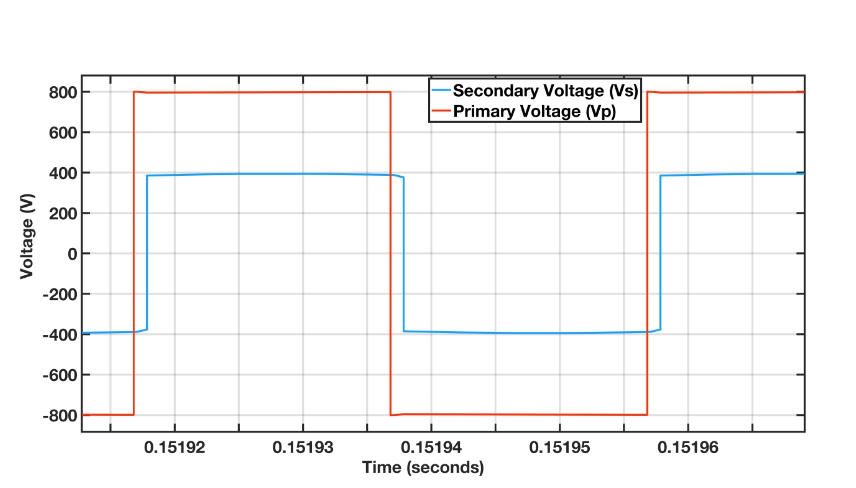
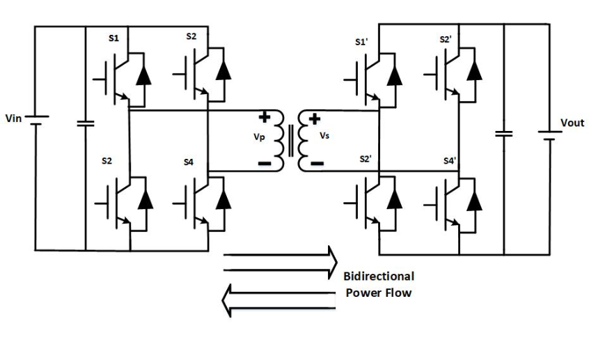
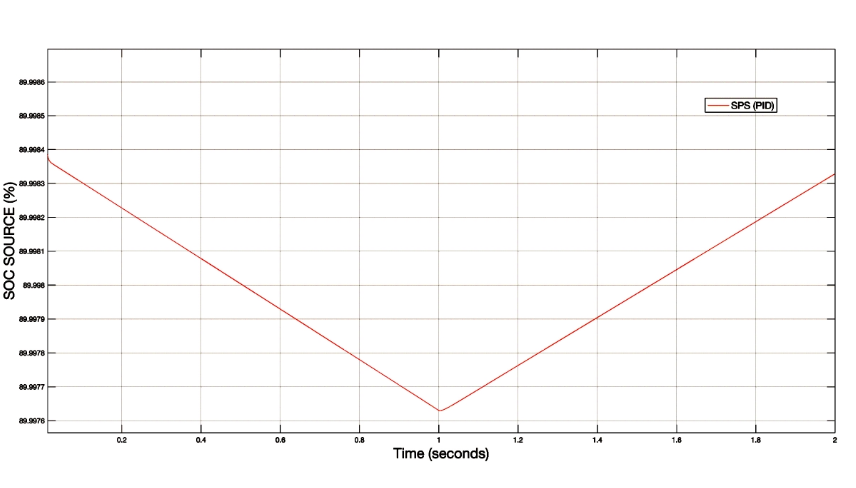

# Dual-Active-Bridge-Converter (DAB)

This repository contains MATLAB/Simulink models demonstrating the operation of a Dual Active Bridge (DAB) DC-DC converter, commonly used in renewable energy systems and electric vehicle (EV) applications for bidirectional power transfer. The DAB converter is modeled with different load configurations and modulation techniques to study its dynamic behavior under various conditions.

---

## Single Phase Shift Modulation Technique

The primary and secondary voltage phase difference determines the power flow between the primary and secondary side of the transformer. This modulation technique is implemented in the <code>DAB_Rload.slx</code> file. Also, 

 

## DAB DC - DC converter with Battery load

A Battery is connected at load that will charge for T=1sec and discharge after T=1sec. Inbuilt simulink generic model of Battery is used in this project, in order to show the %SOC of the EV Battery. This way, the bidirectional power flow from vehicle to Grid and Grid to vehicle can be easily analyzed. The schematic of the DAB converter with loads and its charging and discharging of Load Battery is shown in the figures below. The DAB DC - DC converter with Battery load is given in <code>DAB_batteryload.slx</code> file.

 
